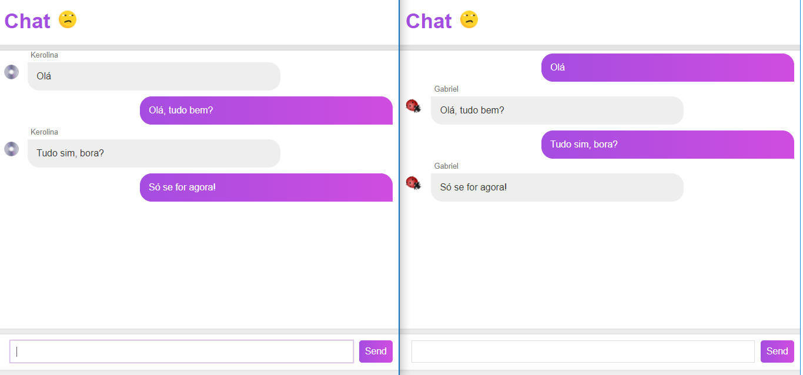

  
  
  
  
  

<h3 align="center">Chat Usando Websockets</h3>

  Um simples chat onde multiplos usuários podem interagir entre si usando websockets.
   

<h3>Informações gerais</h3>

### Como Iniciar           
Este projeto se trata de um "hello world" em websockets, onde através de javascript conseguimos conectar um servidor a vários clientes que podem interagir entre si.

